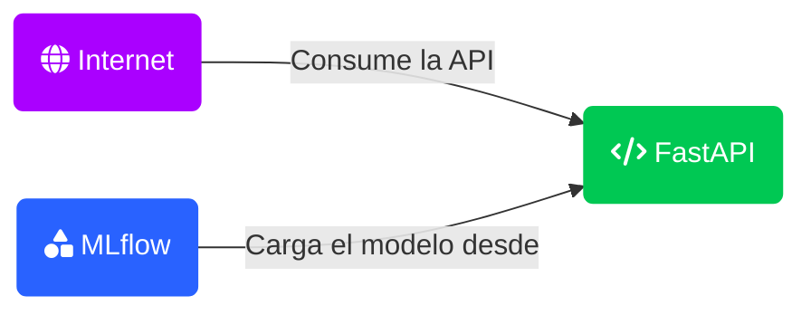

# YOM Challenge

El objetivo de esta prueba es entender tus habilidades para tomar un modelo hecho en local
por un Data Scientist y dejarlo en un ambiente simulado de producción.
Los aspectos que evaluaremos son:
● Calidad del código (refactorización, orden, lógica, uso de patrones de diseño, etc)
● Capacidad de implementar herramientas que permitan aplicar los principios de ML-Ops
al proyecto en producción (recomendamos Neptune o ML Flow)
● Uso de alguna herramienta que permita contener el ambiente creado para la ejecución y
hacerlo reproducible fácilmente para alguien que quiera ejecutarlo
● Documentación clara y fácil de leer
Tienes bonus si:
● Específicas cómo vas a abordar la interacción del modelo con el mundo real y nos
explicas cómo vas a prevenir la degradación del modelo
● Creas mecanismos de monitoreo que permitan alertar cuando exista un deterioro del
modelo
● Usas herramientas de automatización de creación de infraestructura

La prueba consiste en tomar este challenge realizado para una prueba técnica hace varios
años y modificarlo para que cumpla con los requerimientos presentados anteriormente.
El objetivo del challenge inicial está especificado aquí, pero recuerda que tu objetivo no es
resolver el problema de modelamiento sino que tomar lo que hizo este DS junior y dejarlo en
algo que pueda ser pasado a producción.

# 1. Contexto

Se busca poner en producción un modelo de sklearn que precide si una canción es de regaeton o no.

## 1.1 Patrón

El patrón Singleton y el patrón Flyweight tienen propósitos diferentes y se usan en contextos distintos. A continuación, comparo ambos patrones para ver cuál se adapta mejor a tu caso:

### 1.1.1 Singleton:

    - Propósito: Garantizar que una clase tenga una única instancia y proporcionar un punto de acceso global a esa instancia.
    - Uso: Es adecuado para gestionar recursos que deben ser únicos en el sistema, como la carga de un modelo de machine learning que solo necesita ser cargado una vez y reutilizado en todas las solicitudes.

### 1.1.2 Flyweight:

    - Propósito: Reducir el uso de memoria compartiendo la mayor cantidad de datos posible con objetos similares.
    - Uso: Es adecuado cuando se necesita manejar una gran cantidad de objetos similares que comparten datos comunes, lo cual no es exactamente el caso aquí.

### 1.1.3 En resumen
Para desplegar un modelo de machine learning, el Singleton parece más apropiado por las siguientes razones:

    - Única Instancia del Modelo: El modelo de machine learning debe cargarse una sola vez y reutilizarse, evitando recargas innecesarias que pueden ser costosas en términos de tiempo y recursos.
    - Acceso Global: El Singleton proporciona un punto de acceso global a la instancia del modelo, lo cual es ideal para servir predicciones a múltiples solicitudes concurrentes.
    - Mantenimiento: El uso de Singleton puede ser más apropiado en aplicaciones más grandes y complejas donde el control y la encapsulación son cruciales. 

## 1.2 Arquitectura



### 1.2.1 MLflow para Tracking:
Se decidio usar MLflow solo para tracking y no para el despliegue debido a:

- Propósito Específico: MLflow está diseñado específicamente para el seguimiento y gestión del ciclo de vida de los experimentos de machine learning, incluyendo la experimentación, la reproducción de resultados y la comparación de modelos.

- Versionado y Registro de Modelos: MLflow facilita el registro, versionado y almacenamiento de modelos, además de capturar métricas, parámetros y artefactos asociados a cada experimento.

- Interfaz de Usuario: Ofrece una interfaz web intuitiva que permite visualizar y comparar experimentos de manera sencilla.    

- Uso Interno: MLflow está diseñado principalmente para ser utilizado en entornos internos durante el desarrollo y experimentación de modelos. Por lo tanto, no está optimizado para el control de acceso granular y la exposición a clientes externos.

- Enfoque en Tracking: Mientras que MLflow es excelente para gestionar el ciclo de vida de los experimentos, no está optimizado para manejar solicitudes de alta frecuencia y baja latencia, como las que se esperan de una API en producción.

- Carga y Recursos: Su infraestructura no está diseñada para soportar cargas intensivas de tráfico externo.

### 1.2.2 FastAPI para Despliegue:

Se decidio usar FastAPI para el despliegue debido a:

- Desempeño y Escalabilidad: FastAPI es conocido por su alto rendimiento y capacidad de manejar muchas solicitudes concurrentes, lo que es crucial para la fase de despliegue de un modelo.

- Flexibilidad: Permite crear APIs RESTful rápidas y eficientes, integrándose fácilmente con otras tecnologías y servicios.

- Facilidad de Uso: Ofrece una sintaxis sencilla y soporta la generación automática de documentación de API, lo 
que facilita el mantenimiento y la colaboración.    

- Autenticación y Autorización: FastAPI permite la implementación de diversas estrategias de autenticación (OAuth2, JWT, etc.) y autorización, proporcionando un control de acceso robusto y seguro.

- Configuración de Seguridad: Es más adecuado para configurar certificados SSL/TLS y gestionar conexiones seguras, algo crucial cuando se expone una API a usuarios externos.

- Asincronía y Concurrencia: FastAPI utiliza ASGI (Asynchronous Server Gateway Interface) para manejar solicitudes de manera asíncrona, permitiendo un manejo eficiente de múltiples conexiones concurrentes.

- Despliegue y Escalado: Es más sencillo desplegar FastAPI en servicios de orquestación y escalado automático como ElasticBeanstalk, lo que garantiza alta disponibilidad y balanceo de carga.

# 2. Instalación

Se recomienda el uso de Docker, para ello instalarlo previamente

1. ```docker-compose up -d``` Para iniciar el entorno con los requisitos, se opto por docker-compose y no solo Dockerfile para ejecutar pruebas en local

# 3. Prevenir degradación del modelo

mdoe 1
{
  "danceability": 0.61,
  "energy": 0.88,
  "speechiness": 0.06,
  "acousticness": 0.00,
  "valence": 0.46,
  "tempo": 131.06,
  "loudness": -4.43
}
mode 0
{
  "danceability": 0.62,
  "energy": 0.77,
  "speechiness": 0.11,
  "acousticness": 0.04,
  "valence": 0.55,
  "tempo": 180.00,
  "loudness": -5.59
}
1
{
  "danceability": 0.641,
  "energy": 0.693,
  "speechiness": 0.163,
  "acousticness": 0.0169,
  "valence": 0.899,
  "tempo": 214.058,
  "loudness": -7.327
}
0
{
  "danceability": 0.512,
  "energy": 0.541,
  "speechiness": 0.141,
  "acousticness": 0.781,
  "valence": 0.941,
  "tempo": 125.513,
  "loudness": 125.513
}


Referencias:
https://medium.com/@dast04/running-airflow-with-docker-compose-2023-for-machine-learning-a78eeadc00cd
https://github.com/sachua/mlflow-docker-compose/tree/master/mlflow
https://anderfernandez.com/blog/tutorial-mlflow-completo/